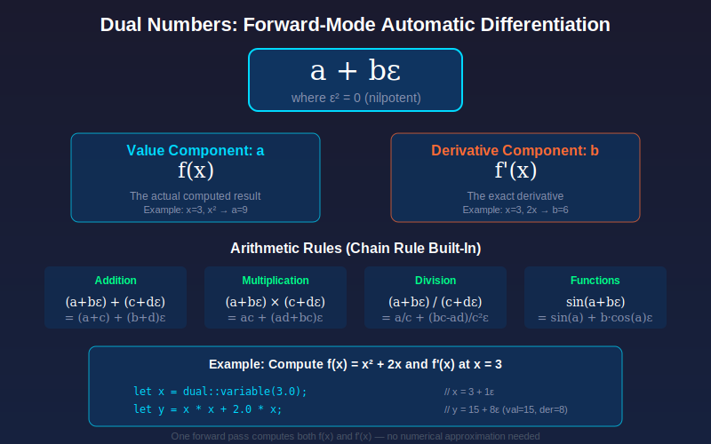

# Simplex Diagrams

**Version:** 0.9.0

This directory contains SVG diagrams illustrating key mathematical and architectural concepts in Simplex.

## Diagram Index

| Diagram | Description | Related Docs |
|---------|-------------|--------------|
| [meta-gradient-annealing.svg](meta-gradient-annealing.svg) | Self-learning annealing with dual numbers and temperature control | [Cognitive Hive](../spec/09-cognitive-hive.md), [Neural IR](../spec/14-neural-ir.md) |
| [dual-numbers.svg](dual-numbers.svg) | Forward-mode automatic differentiation using dual numbers | [Language Syntax](../spec/04-language-syntax.md) |
| [gumbel-softmax.svg](gumbel-softmax.svg) | Temperature-controlled gate hardness via Gumbel-Softmax | [Neural IR](../spec/14-neural-ir.md) |
| [cognitive-hive-architecture.svg](cognitive-hive-architecture.svg) | Per-hive SLM architecture with specialists | [Cognitive Hive](../spec/09-cognitive-hive.md) |
| [memory-hierarchy.svg](memory-hierarchy.svg) | Three-tier memory: Anima → Mnemonic → Divine | [Cognitive Hive](../spec/09-cognitive-hive.md), [Anima](../spec/12-anima.md) |
| [actor-supervision.svg](actor-supervision.svg) | Actor supervision trees and "Let It Crash" philosophy | [Overview](../spec/01-overview.md), [Swarm Computing](../spec/06-swarm-computing.md) |
| [inference-pipeline.svg](inference-pipeline.svg) | High-performance inference via llama.cpp | [Cognitive Hive](../spec/09-cognitive-hive.md), [SLM Provisioning](../spec/13-slm-provisioning.md) |
| [neural-ir-compilation.svg](neural-ir-compilation.svg) | Neural IR compilation from probabilistic to symbolic | [Neural IR](../spec/14-neural-ir.md) |
| [test-suite-structure.svg](test-suite-structure.svg) | Test suite organization (156 tests, 13 categories) | [Testing](../testing/README.md) |

## Usage in Documentation

Reference diagrams in markdown files:

```markdown

```

Or with HTML for sizing control:

```html

```

## Design Guidelines

All diagrams follow consistent styling:

### Colors

| Element | Color | Hex |
|---------|-------|-----|
| Background | Dark blue gradient | `#1a1a2e` → `#16213e` |
| Primary accent (Temperature, Flow) | Cyan | `#00d9ff` |
| Secondary accent (Success, Output) | Green | `#00ff88` |
| Warning/Input | Orange | `#ff6b35` |
| Special (Divine, Training) | Purple | `#9d4edd` |
| Muted text | Gray | `#8892b0` |

### Typography

- **Titles**: Arial, 20px, bold, white
- **Labels**: Arial, 12px, accent color
- **Code**: Monospace, 9-10px, cyan

### Components

- **Boxes**: 8px border radius, gradient fills with glow filter
- **Arrows**: 2px stroke, `#8892b0`, with arrowhead markers
- **Annotations**: Rounded rectangles with dark background

## Regenerating Diagrams

Diagrams are generated as SVG for:
- Scalability (vector graphics)
- Small file size
- Easy version control (text-based)
- No external dependencies

To modify a diagram, edit the SVG directly or use a vector editor like Inkscape.

## Concepts Covered

### Mathematical Concepts

1. **Dual Numbers** (`a + bε` where `ε² = 0`)
   - Forward-mode automatic differentiation
   - Value and derivative in single pass
   - Chain rule built into arithmetic

2. **Meta-Gradients** (`∂Loss/∂τ`)
   - Self-learning optimization schedules
   - Automatic temperature control
   - Local minima escape via re-heating

3. **Gumbel-Softmax**
   - Differentiable discrete sampling
   - Temperature-controlled exploration/exploitation
   - Gradient flow through categorical choices

### Architectural Concepts

1. **Per-Hive SLM**
   - One model shared by all specialists
   - Memory efficiency (8-12GB vs 80+GB)
   - HiveMnemonic for shared consciousness

2. **Three-Tier Memory**
   - Anima: Personal (30% belief threshold)
   - Mnemonic: Shared (50% threshold)
   - Divine: Global (70% threshold)

3. **Actor Supervision**
   - "Let It Crash" philosophy
   - OneForOne, RestForOne, OneForAll strategies
   - Automatic failure recovery

4. **Neural IR Compilation**
   - Training mode: Gumbel-Softmax (differentiable)
   - Inference mode: Compiled branches (zero overhead)
   - Automatic neurosymbolic transition

## Adding New Diagrams

When creating new diagrams:

1. Follow the color scheme above
2. Use consistent typography
3. Include a title and brief labels
4. Add glow effects to primary elements
5. Keep file size reasonable (<100KB)
6. Update this README with the new diagram

## See Also

- [Simplex Specification](../spec/README.md)
- [Release Notes v0.9.0](../RELEASE-0.9.0.md)
- [Testing Documentation](../testing/README.md)
