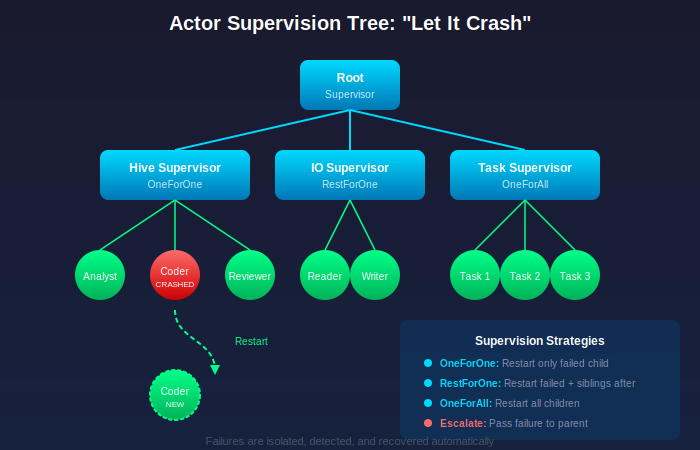

# Simplex Overview and Philosophy

**Version 0.9.0**

---

## Vision

Simplex is built on a singular premise: modern software runs on distributed, ephemeral infrastructure and increasingly relies on AI capabilities. The language should embrace these realities as first-class concerns, not afterthoughts.

---

## What's New in v0.9.0

### Self-Learning Annealing

Optimization schedules that learn themselves through meta-gradients. The core formula uses dual numbers (`a + bε` where `ε² = 0`) to compute both values and derivatives simultaneously:

```simplex
use simplex::optimize::anneal::{self_learn_anneal, AnnealConfig};

// Schedule parameters are learned, not hand-tuned
let best = self_learn_anneal(
    objective,
    initial_solution,
    neighbor_fn,
    AnnealConfig::default()
);
```

The meta-gradient `∂Loss/∂τ` automatically controls temperature:
- **Simple problems**: Temperature smoothly decreases (standard annealing)
- **Complex problems**: System detects local minima and automatically re-heats to escape

See [Meta-Gradient Temperature Control](09-cognitive-hive.md#meta-gradient-temperature-control) for visual diagrams and detailed explanation.

### Dual Numbers (v0.8.0)

Native forward-mode automatic differentiation:

```simplex
let x: dual = dual::variable(3.0)
let y = x * x + x.sin()
print(y.val)  // f(3) = 9.1411...
print(y.der)  // f'(3) = 6.9899... (exact, not numerical)
```

### llama.cpp Integration

High-performance inference via native llama.cpp bindings:

```simplex
use simplex_inference::{InferencePipeline, BatchConfig};

let pipeline = InferencePipeline::builder()
    .with_batching(BatchConfig { max_size: 8, timeout_ms: 50 })
    .with_prompt_cache(1000)
    .build();
```

### Test Suite Restructure

156 tests organized across 13 categories with consistent naming:

```bash
./tests/run_tests.sh neural    # Run neural IR tests
./tests/run_tests.sh learning  # Run AD tests
./tests/run_tests.sh all unit  # Run all unit tests
```

---

## Primary Goals

- **AI-native**: Artificial intelligence primitives built into the language semantics
- **Differentiable**: Native dual numbers enable automatic differentiation (v0.8.0)
- **Self-optimizing**: Hyperparameters learn themselves via meta-gradients (v0.9.0)
- **Distributed-first**: Programs naturally decompose across swarms of virtual machines
- **Fault-tolerant**: Any worker can die at any time; the system continues
- **Resumable**: Computations checkpoint and resume transparently
- **Lightweight syntax**: Simple, readable code that compiles to efficient native binaries

---

## Non-Goals

- Simplex is not designed for systems programming (use Rust)
- Simplex is not optimized for single-machine performance (use C/C++)
- Simplex does not prioritize backwards compatibility with existing ecosystems

---

## Core Philosophy

### Let It Crash



Borrowed from Erlang, Simplex embraces failure as normal. Rather than defensive programming with extensive error handling, Simplex programs are structured as supervision trees where failures are isolated, detected, and recovered automatically.

Traditional approach:
```
try {
    result = riskyOperation()
} catch (Error e) {
    log(e)
    fallback()
    retry()
    // ... extensive error handling
}
```

Simplex approach:
```simplex
// Just do the work. Supervisor handles failures.
receive ProcessOrder(order: Order) {
    validate(order)
    charge(order.payment)
    ship(order)
    // If any step fails, actor restarts from last checkpoint
}
```

### Ownership Without Garbage Collection

Borrowed from Rust, Simplex uses an ownership model for memory management. Values have a single owner, can be borrowed temporarily, and are deallocated when ownership ends. This eliminates garbage collection pauses critical for predictable distributed systems.

Benefits:
- Deterministic memory deallocation
- No GC pauses disrupting real-time processing
- Clear semantics for serializing data across the network
- Compile-time memory safety

### Content-Addressed Code

Borrowed from Unison, Simplex functions are identified by the hash of their implementation. This enables:

- **Perfect caching**: Same function = same hash = cached result
- **Trivial serialization**: Ship function hash, not source code
- **No dependency conflicts**: No "works on my machine" problems
- **Seamless distribution**: Code can migrate with computation

```simplex
// Function identified by hash of its implementation
fn process(data: Data) -> Result {  // Hash: 0x7f3a...
    transform(data)
}

// When actor migrates to new node:
// 1. Checkpoint contains function hash 0x7f3a...
// 2. New node fetches function by hash (or already has it cached)
// 3. Execution resumes with identical semantics
```

### Actors as the Unit of Distribution

The actor model provides natural boundaries for:

| Concern | How Actors Help |
|---------|-----------------|
| State isolation | No shared mutable state between actors |
| Failure isolation | One actor crashing does not affect others |
| Distribution | Actors communicate via messages, location-transparent |
| Checkpointing | Actor state captured at message boundaries |

```simplex
actor OrderProcessor {
    var pending: Map<OrderId, Order> = {}

    receive Process(order: Order) {
        pending.insert(order.id, order)
        checkpoint()  // State is now durable

        // Process the order...
        let result = fulfill(order)

        pending.remove(order.id)
        checkpoint()
    }
}
```

---

## Target Use Cases

### Well-Suited

- Distributed data processing pipelines
- AI-augmented applications (RAG, agents, extraction)
- Event-driven microservices
- Real-time stream processing
- Fault-tolerant business workflows

### Not Suited

- Operating system kernels
- Device drivers
- High-frequency trading (single-digit microsecond latency)
- Bare-metal embedded systems
- GUI applications

---

## Comparison with Existing Languages

| Language | Strength | Simplex Advantage |
|----------|----------|-------------------|
| Erlang | Fault tolerance, actors | + AI integration, + ownership (no GC) |
| Rust | Memory safety, performance | + Distribution primitives, + AI integration |
| Python | AI/ML ecosystem | + Type safety, + fault tolerance, + performance |
| Go | Simple concurrency | + Actor model, + checkpointing, + AI integration |
| Java | Enterprise, JVM ecosystem | + Lightweight runtime, + spot instance ready |

---

## Next Steps

- [Architecture](02-architecture.md): System component overview
- [Language Syntax](04-language-syntax.md): Start writing Simplex code
- [Examples](../examples/document-pipeline.md): See a complete program
