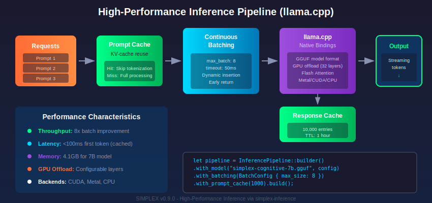
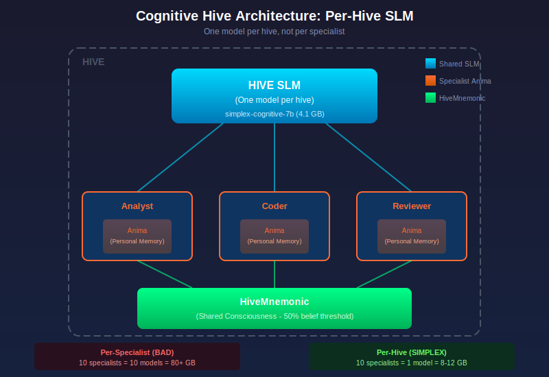
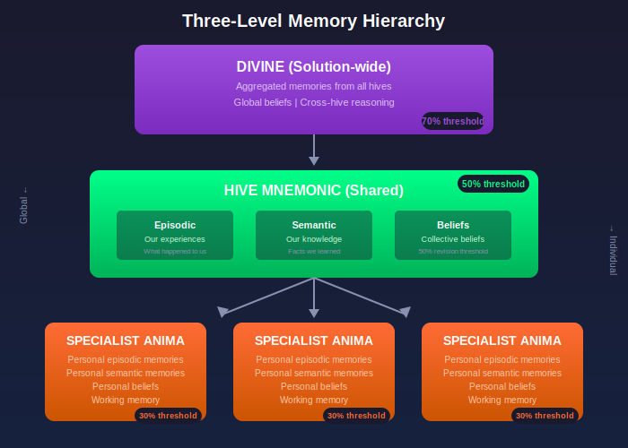

# Cognitive Hive AI Architecture

**Version 0.10.0**

**The future of AI is not one giant mind, but a swarm of specialists.**

Simplex embraces the Cognitive Hive AI (CHAI) philosophy as a core architectural principle. Rather than relying on monolithic Large Language Models (LLMs), Simplex enables the orchestration of Small Language Models (SLMs) working as specialized agents within a coordinated hive.

---

## Recent Enhancements

### High-Performance Inference via llama.cpp



Native llama.cpp bindings provide optimized inference for hive specialists:

```simplex
use simplex_inference::{InferencePipeline, BatchConfig, ModelLoadConfig}

// Configure inference backend
let config = ModelLoadConfig {
    gpu_layers: 32,           // Offload to GPU
    context_size: 4096,
    flash_attention: true,    // Enable flash attention
    ..Default::default()
}

// Create batched inference pipeline
let pipeline = InferencePipeline::builder()
    .with_model("simplex-cognitive-7b.gguf", config)
    .with_batching(BatchConfig { max_size: 8, timeout_ms: 50 })
    .with_prompt_cache(1000)
    .with_response_cache(CacheConfig { capacity: 10000, ttl_ms: 3600000 })
    .build()
```

### Self-Learning Specialist Schedules

Specialists can now learn optimal training and inference schedules:

```simplex
use simplex::optimize::anneal::{LearnableSchedule, MetaOptimizer}

specialist AdaptiveAnalyzer {
    schedule: LearnableSchedule,  // Temperature, cooling rate learned automatically

    fn optimize_hyperparams(&mut self, objective: fn(&Config) -> dual) {
        let optimizer = MetaOptimizer::new(self.schedule)
        self.schedule = optimizer.optimize(initial_config, neighbor_fn, 100)
    }
}
```

### Meta-Gradient Temperature Control


Simplex's self-learning annealing uses **meta-gradients** to automatically control temperature schedules for neural gates. This is fundamentally different from traditional fixed annealing schedules.

#### The Core Formula: Dual Numbers

```
a + bε   where ε² = 0
```

- `a` = the computed value
- `b` = the derivative (gradient)
- `ε` = infinitesimal (nilpotent)

This dual number representation enables **forward-mode automatic differentiation**, computing both values and their derivatives in a single pass. The meta-gradient `∂Loss/∂τ` tells the system whether to heat up or cool down.

#### Two Training Scenarios

**Scenario 1: Rapid Convergence (Simple Problems)**

For simple problems like XOR gates, the temperature schedule follows standard annealing:

```
Temperature (τ)
    │
1.0 ┤  ╲                          High τ: Explore (Fuzzy Logic)
    │    ╲
    │      ╲   Meta-gradient: ∂L/∂τ < 0
    │        ╲   (keep cooling)
    │          ╲
0.0 ┤            ╲___________     Low τ: Exploit (Hard Logic Found!)
    └────────────────────────────
    0           Training Steps →
```

- **High τ (start)**: Neural gates output soft/fuzzy probabilities (exploration)
- **Meta-gradient negative**: `∂Loss/∂τ < 0` signals continued cooling is beneficial
- **Low τ (end)**: Gates converge to hard discrete decisions (exploitation)

**Scenario 2: Complex Patterns (Self-Learning Kicks In)**

For complex pattern recognition, the meta-gradient detects local minima and triggers re-heating:

```
Temperature (τ)
    │
1.0 ┤  ╲           ╱╲
    │    ╲       ╱    ╲           Meta-gradient: Re-heat to Explore!
    │      ╲   ╱        ╲
    │        ╲╱           ╲       τ plateaus: Stuck in Local Minima?
    │    (local min)        ╲
0.0 ┤                         ╲___  Eventually Converges (Optimal Logic)
    └────────────────────────────
    0           Training Steps →
```

- **Initial cooling**: Temperature drops but loss plateaus (stuck)
- **Meta-gradient detection**: `∂Loss/∂τ > 0` signals re-heating would help
- **Automatic re-heat**: System increases τ to escape local minimum
- **Final convergence**: After exploration, converges to optimal solution

#### How Temperature Controls Neural Gates

Temperature (τ) controls the "hardness" of neural gate decisions via Gumbel-Softmax:

```simplex
// High τ (exploration): soft probabilistic output
// gate outputs ≈ [0.4, 0.35, 0.25] - uncertain, exploring

// Low τ (exploitation): hard discrete output
// gate outputs ≈ [0.99, 0.005, 0.005] - confident, committed
```

#### The Meta-Optimizer

```simplex
use simplex::optimize::anneal::{MetaOptimizer, LearnableSchedule}

// Create learnable schedule with dual number parameters
let schedule = LearnableSchedule::new(
    initial_temp: dual(1.0),      // τ₀ as dual number
    cooling_rate: dual(0.95),     // α as dual number
    min_temp: dual(0.01),         // τ_min as dual number
)

// Meta-optimizer computes ∂Loss/∂τ automatically
let meta_opt = MetaOptimizer::new(schedule)
    .learning_rate(0.01)
    .momentum(0.9)

// Training loop with meta-gradient updates
for epoch in 0..1000 {
    let loss = train_step(model, data, schedule.current_temp())

    // Meta-gradient tells us: should we heat up or cool down?
    let meta_grad = loss.derivative()  // ∂Loss/∂τ from dual numbers

    if meta_grad > 0.0 {
        // Positive gradient: re-heat to escape local minimum
        schedule.increase_temp()
    } else {
        // Negative gradient: continue cooling
        schedule.step()
    }
}
```

#### Key Insight

> **"Simplex learns the best τᵢ schedule using Meta-Gradients."**

Instead of hand-tuning annealing schedules, Simplex automatically discovers the optimal temperature trajectory for each problem. Simple problems get smooth cooling; complex problems get adaptive re-heating when stuck.

This is the core innovation of self-learning annealing: the system uses the same dual number infrastructure that powers automatic differentiation to also learn *how to learn* more effectively.

---

## Key Architecture: Per-Hive SLM



**Each hive provisions ONE shared SLM that all its specialists use.**

This is the core architectural decision:

```
┌─────────────────────────────────────────────────┐
│                  HIVE SLM                        │
│           (One model per hive)                   │
│         simplex-cognitive-7b (4.1 GB)            │
└──────────────────┬──────────────────────────────┘
                   │
    ┌──────────────┼──────────────┐
    │              │              │
    ▼              ▼              ▼
┌────────┐   ┌────────┐   ┌────────┐
│Analyst │   │Coder   │   │Reviewer│
│ Anima  │   │ Anima  │   │ Anima  │
└────────┘   └────────┘   └────────┘
    │              │              │
    └──────────────┴──────────────┘
              HiveMnemonic
         (Shared consciousness)
```

**Why per-hive, not per-specialist?**

| Per-Specialist (bad) | Per-Hive (Simplex) |
|---------------------|-------------------|
| 10 specialists = 10 models | 10 specialists = 1 model |
| 80+ GB RAM | 8-12 GB RAM |
| Expensive, wasteful | Efficient, practical |

See [SLM Provisioning](13-slm-provisioning.md) for complete architecture details.

---

## Philosophy

### The Problem with Monolithic LLMs

| Issue | Impact |
|-------|--------|
| Cost | $0.03-0.12 per 1K tokens, unpredictable at scale |
| Latency | 500-3000ms per request |
| Control | Black box, prompt engineering required |
| Privacy | Data sent to external APIs |
| Reliability | Rate limits, outages, deprecation |
| Specialization | Jack of all trades, master of none |

### The CHAI Alternative

A cognitive hive is a collection of specialized small models (7B-13B parameters) that:

- **Specialize**: Each model masters a narrow domain
- **Collaborate**: Models communicate through message passing
- **Scale**: Add specialists as needs grow
- **Fail gracefully**: One specialist down doesn't stop the hive
- **Cost pennies**: Run on commodity ARM instances

```
         ┌─────────────────────────────────────────┐
         │              COGNITIVE HIVE              │
         │                                          │
         │    ┌──────┐  ┌──────┐  ┌──────┐        │
         │    │ SLM  │  │ SLM  │  │ SLM  │        │
         │    │ Code │  │ Text │  │ Legal│  ...   │
         │    └──┬───┘  └──┬───┘  └──┬───┘        │
         │       │         │         │             │
         │    ───┴─────────┴─────────┴───         │
         │              Message Bus                │
         │    ────────────────┬──────────         │
         │                    │                    │
         │              ┌─────┴─────┐              │
         │              │  Router   │              │
         │              └─────┬─────┘              │
         │                    │                    │
         └────────────────────┼────────────────────┘
                              │
                         Task Input
```

---

## Naming Conventions

Simplex suggests (but does not enforce) meaningful naming for models and specialists. Two traditions are offered:

### Elvish (Sindarin/Quenya)

Drawing from Tolkien's languages, Elvish names evoke the organic, interconnected nature of the hive. These names carry poetic weight and connect to themes of wisdom, craft, and natural order.

| Elvish | Meaning | Suggested Use |
|--------|---------|---------------|
| **Isto** | Knowledge (Q) | Knowledge retrieval specialist |
| **Penna** | One who tells (S) | Text generation, storytelling |
| **Hend** | Eye (S) | Vision, image analysis |
| **Lasta** | To listen (S) | Audio transcription, understanding |
| **Thind** | Grey (wise) (S) | General reasoning |
| **Curu** | Skill, craft (Q) | Code generation, technical tasks |
| **Golwen** | Wise one (S) | Decision making, arbitration |
| **Runya** | Red flame (Q) | Fast, reactive processing |
| **Silma** | Crystal light (Q) | Clarity, summarization |
| **Ithil** | Moon (S) | Background processing, reflection |
| **Anor** | Sun (S) | Primary/lead specialist |
| **Mellon** | Friend (S) | Conversational, assistant |
| **Hîr** | Lord/Master (S) | Orchestrator, router |
| **Edhel** | Elf (S) | Meta-learning, adaptation |
| **Thalion** | Steadfast (S) | Reliable, deterministic tasks |

**Example Usage:**
```simplex
specialist Curu {
    model: "codellama-7b",
    domain: "code generation and review"
}

specialist Silma {
    model: "mistral-7b-instruct",
    domain: "summarization and clarity"
}

hive Mellon {
    router: Hîr,
    specialists: [Curu, Silma, Penna, Isto]
}
```

### Latin

Latin names carry gravitas and precision, connecting to scientific and legal traditions. They communicate function with classical clarity.

| Latin | Meaning | Suggested Use |
|-------|---------|---------------|
| **Cogito** | I think | Reasoning, analysis |
| **Scribo** | I write | Text generation, composition |
| **Lego** | I read/gather | Document processing, extraction |
| **Video** | I see | Vision, image understanding |
| **Audio** | I hear | Speech, audio processing |
| **Sentio** | I perceive/feel | Sentiment, emotion analysis |
| **Memor** | Mindful | Memory, context management |
| **Index** | Pointer | Routing, classification |
| **Judex** | Judge | Decision making, arbitration |
| **Custos** | Guardian | Validation, safety checking |
| **Nexus** | Connection | Integration, API bridging |
| **Vertex** | Peak/turning point | Orchestration, coordination |
| **Faber** | Craftsman | Code, technical generation |
| **Medicus** | Healer | Error correction, repair |
| **Vigil** | Watchman | Monitoring, alerting |

**Example Usage:**
```simplex
specialist Cogito {
    model: "llama2-13b",
    domain: "logical reasoning and analysis"
}

specialist Lego {
    model: "ner-extraction-7b",
    domain: "entity and data extraction"
}

hive Vertex {
    router: Index,
    specialists: [Cogito, Lego, Scribo, Sentio]
}
```

### Choosing a Convention

| Consider Elvish When | Consider Latin When |
|---------------------|---------------------|
| Building creative/consumer products | Building enterprise/B2B systems |
| Team appreciates whimsy | Team prefers classical formality |
| Names should feel organic | Names should feel technical |
| You're a Tolkien fan | You're classically inclined |

Both conventions can coexist. The Elvish router `Hîr` can orchestrate Latin specialists, or vice versa. The system doesn't enforce naming—these are cultural suggestions for readability and meaning.

---

## Core Constructs

### Specialists

A specialist is an actor wrapping a small language model:

```simplex
specialist EntityExtractor {
    // Model configuration
    model: "ner-fine-tuned-7b",
    domain: "named entity extraction",

    // Resource constraints
    memory: 8.GB,
    compute: "gpu.small",  // or "cpu.medium"

    // Behavioral configuration
    temperature: 0.1,      // Low for deterministic extraction
    max_tokens: 500,

    // Message handlers
    receive Extract(text: String) -> List<Entity> {
        let raw = infer("Extract all named entities from: {text}")
        parse_entities(raw)
    }

    receive ExtractTyped(text: String, entity_types: List<EntityType>) -> List<Entity> {
        let types_str = entity_types.join(", ")
        let raw = infer("Extract {types_str} entities from: {text}")
        parse_entities(raw).filter(|e| entity_types.contains(e.type))
    }
}
```

### The `infer` Primitive

Within a specialist, `infer` calls the underlying model:

```simplex
specialist Summarizer {
    model: "mistral-7b-instruct",

    receive Summarize(text: String, style: SummaryStyle) -> String {
        let prompt = match style {
            SummaryStyle::Brief => "Summarize in one sentence: {text}",
            SummaryStyle::Detailed => "Provide a detailed summary: {text}",
            SummaryStyle::Bullets => "Summarize as bullet points: {text}"
        }

        infer(prompt)  // Calls the specialist's model
    }
}
```

**`infer` Options:**

```simplex
// Basic inference
let result = infer(prompt)

// With parameters
let result = infer(
    prompt,
    temperature: 0.7,
    max_tokens: 200,
    stop_sequences: ["\n\n", "END"]
)

// Streaming inference
for chunk in infer_stream(prompt) {
    emit(chunk)
}

// Structured output (parsed to type)
let data = infer_typed<Person>(prompt)
```

### Hives

A hive is a supervisor for specialists with routing intelligence:

```simplex
hive DocumentProcessor {
    // Specialists in this hive
    specialists: [
        Summarizer,
        EntityExtractor,
        SentimentAnalyzer,
        Translator,
        Classifier
    ],

    // How tasks are routed to specialists
    router: SemanticRouter(
        embedding_model: "all-minilm-l6-v2",
        fallback: Summarizer  // Default if no match
    ),

    // Supervision strategy for specialists
    strategy: OneForOne,
    max_restarts: 5,
    within: Duration::minutes(1),

    // Shared resources
    memory: SharedVectorStore(dimension: 384),
    context: ConversationBuffer(max_turns: 50)
}
```

### Spawning and Using Hives

```simplex
fn main() {
    // Spawn the hive (starts all specialists)
    let hive = spawn DocumentProcessor

    // Automatic routing - hive decides which specialist
    let result = ask(hive, Process("Summarize this legal document..."))

    // Direct specialist access
    let summary = ask(hive.Summarizer, Summarize(text, Brief))

    // Check which specialists are available
    let available = hive.specialists()
    print("Active specialists: {available}")
}
```

---

## Routing Strategies

### Semantic Router

Routes based on embedding similarity between task and specialist domains:

```simplex
router SemanticRouter {
    embedding_model: "all-minilm-l6-v2",
    threshold: 0.7,  // Minimum similarity to route
    fallback: GeneralAssistant,

    fn route(task: Task) -> Specialist {
        let task_embedding = embed(task.description)

        var best_match: Option<Specialist> = None
        var best_score: f64 = 0.0

        for specialist in hive.specialists {
            let score = cosine_similarity(task_embedding, specialist.domain_embedding)
            if score > best_score && score >= threshold {
                best_score = score
                best_match = Some(specialist)
            }
        }

        best_match.unwrap_or(fallback)
    }
}
```

### Rule Router

Routes based on explicit rules:

```simplex
router RuleRouter {
    rules: [
        Rule(pattern: r"summar|brief|tldr", specialist: Summarizer),
        Rule(pattern: r"translat|convert to", specialist: Translator),
        Rule(pattern: r"extract|find all|list the", specialist: EntityExtractor),
        Rule(pattern: r"sentiment|feeling|emotion", specialist: SentimentAnalyzer),
        Rule(pattern: r"code|function|bug|review", specialist: CodeReviewer)
    ],
    fallback: GeneralAssistant
}
```

### LLM Router

Uses a small, fast model to decide routing:

```simplex
router LLMRouter {
    model: "tinyllama-1b",  // Very small, very fast

    fn route(task: Task) -> Specialist {
        let specialists_desc = hive.specialists
            .map(|s| "{s.name}: {s.domain}")
            .join("\n")

        let choice = infer("""
            Given these specialists:
            {specialists_desc}

            Which specialist should handle: {task.description}

            Reply with only the specialist name.
        """)

        hive.get_specialist(choice.trim())
    }
}
```

### Cascade Router

Try specialists in order until one succeeds:

```simplex
router CascadeRouter {
    cascade: [
        (EntityExtractor, confidence_threshold: 0.9),
        (GeneralExtractor, confidence_threshold: 0.7),
        (Fallback, confidence_threshold: 0.0)
    ],

    fn route(task: Task) -> Response {
        for (specialist, threshold) in cascade {
            let result = ask(specialist, task)
            if result.confidence >= threshold {
                return result
            }
        }
        Err(NoConfidentResult)
    }
}
```

---

## Ensemble Patterns

### Parallel Ensemble

Ask multiple specialists simultaneously:

```simplex
fn analyze_document(doc: Document) -> Analysis {
    // All specialists work in parallel
    let (summary, entities, sentiment, topics) = await parallel(
        ask(hive.Summarizer, Summarize(doc.text)),
        ask(hive.EntityExtractor, Extract(doc.text)),
        ask(hive.SentimentAnalyzer, Analyze(doc.text)),
        ask(hive.TopicClassifier, Classify(doc.text))
    )

    Analysis { summary, entities, sentiment, topics }
}
```

### Voting Ensemble

Multiple specialists vote on a decision:

```simplex
fn classify_with_confidence(text: String) -> Classification {
    // Ask three different classifiers
    let votes = await parallel(
        ask(hive.ClassifierA, Classify(text)),
        ask(hive.ClassifierB, Classify(text)),
        ask(hive.ClassifierC, Classify(text))
    )

    // Count votes
    let vote_counts = votes.group_by(|v| v.label).map(|g| (g.key, g.count()))
    let (winner, count) = vote_counts.max_by(|(_, c)| c)

    Classification {
        label: winner,
        confidence: count as f64 / votes.len() as f64,
        dissenting: votes.filter(|v| v.label != winner)
    }
}
```

### Weighted Ensemble

Specialists have different weights based on expertise:

```simplex
fn legal_analysis(document: String) -> LegalOpinion {
    let opinions = await parallel(
        (ask(hive.LegalExpert, Analyze(document)), weight: 0.5),
        (ask(hive.ComplianceChecker, Check(document)), weight: 0.3),
        (ask(hive.RiskAnalyzer, Assess(document)), weight: 0.2)
    )

    weighted_consensus(opinions)
}
```

### Chain of Specialists

Sequential processing pipeline:

```simplex
fn deep_research(query: String) -> ResearchReport {
    // Step 1: Understand the query
    let parsed_query = ask(hive.QueryParser, Parse(query))

    // Step 2: Retrieve relevant information
    let sources = ask(hive.Retriever, Search(parsed_query))

    // Step 3: Analyze each source
    let analyses = sources.map(|s| ask(hive.Analyzer, Analyze(s)))

    // Step 4: Synthesize findings
    let synthesis = ask(hive.Synthesizer, Combine(analyses))

    // Step 5: Format final report
    ask(hive.ReportWriter, Format(synthesis))
}
```

---

## Consensus Mechanisms

When specialists disagree:

### Majority Vote

```simplex
fn majority_vote<T: Eq>(responses: List<T>) -> Option<T> {
    let counts = responses.group_by(|r| r).map(|g| (g.key, g.count()))
    let (winner, count) = counts.max_by(|(_, c)| c)?

    if count > responses.len() / 2 {
        Some(winner)
    } else {
        None  // No majority
    }
}
```

### Arbiter Resolution

```simplex
specialist Arbiter {
    model: "llama2-13b",  // Larger model for complex decisions
    domain: "conflict resolution and synthesis",

    receive Resolve(opinions: List<Opinion>) -> Decision {
        let opinions_text = opinions
            .enumerate()
            .map(|(i, o)| "Opinion {i}: {o.content} (confidence: {o.confidence})")
            .join("\n")

        infer("""
            Multiple specialists have provided different opinions:

            {opinions_text}

            Analyze the disagreements and provide a final decision with reasoning.
        """)
    }
}
```

### Confidence-Weighted

```simplex
fn confidence_weighted<T>(responses: List<(T, f64)>) -> T {
    // Weight by confidence score
    let weighted = responses
        .group_by(|(value, _)| value)
        .map(|g| (g.key, g.values.map(|(_, conf)| conf).sum()))

    weighted.max_by(|(_, weight)| weight).0
}
```

---

## The HiveMnemonic: Shared Consciousness

**v0.5.0 Feature**

The HiveMnemonic is the shared memory layer that creates collective consciousness across all specialists in a hive.

### Three-Level Memory Hierarchy



```
┌─────────────────────────────────────────────────────────────┐
│              SPECIALIST ANIMA (Individual)                   │
│   - Personal episodic memories (my experiences)              │
│   - Personal semantic memories (my knowledge)                │
│   - Personal beliefs (30% revision threshold)                │
│   - Working memory (active context)                          │
└──────────────────────────┬──────────────────────────────────┘
                           │
                           ▼
┌─────────────────────────────────────────────────────────────┐
│               HIVE MNEMONIC (Shared)                         │
│   - Shared episodic memories (our experiences)               │
│   - Shared semantic memories (our knowledge)                 │
│   - Collective beliefs (50% revision threshold)              │
│   - All specialists read/write to this                       │
└──────────────────────────┬──────────────────────────────────┘
                           │
                           ▼
┌─────────────────────────────────────────────────────────────┐
│               DIVINE (Solution-wide, optional)               │
│   - Aggregated memories from all hives                       │
│   - Global beliefs (70% revision threshold)                  │
│   - Cross-hive reasoning                                     │
└─────────────────────────────────────────────────────────────┘
```

### Defining a Hive with Mnemonic

```simplex
hive AnalyticsHive {
    // Specialists in this hive
    specialists: [Analyzer, Summarizer, Critic],

    // Shared SLM for all specialists
    slm: "simplex-cognitive-7b",

    // Shared consciousness (mnemonic)
    mnemonic: {
        episodic: {
            capacity: 1000,
            importance_threshold: 0.4,
        },
        semantic: {
            capacity: 5000,
        },
        beliefs: {
            revision_threshold: 50,  // 50% vs 30% individual
            contradiction_resolution: ConsensusWithEvidence,
        },
    },

    strategy: OneForOne,
}
```

### How Context Flows to the SLM

When a specialist calls `infer()`:

1. **Personal context** - Specialist's Anima memories are formatted
2. **Shared context** - Hive's Mnemonic is added
3. **Combined prompt** - Both contexts prepended to the prompt
4. **Inference** - Sent to the shared Hive SLM

```simplex
specialist Analyst {
    receive Analyze(text: String) -> String {
        // When infer() is called:
        // 1. My Anima memories → formatted as context
        // 2. Hive Mnemonic → added to context
        // 3. "Analyze: {text}" → appended
        // 4. Sent to hive.slm for inference
        infer("Analyze: " + text)
    }
}
```

### Contributing to Shared Memory

```simplex
specialist Researcher {
    receive Research(topic: String) {
        let findings = do_research(topic)

        // Personal memory (my Anima)
        self.anima.remember("I researched: {topic}")

        // Shared memory (Hive Mnemonic)
        hive.mnemonic.learn("Research finding: {findings.summary}")
        hive.mnemonic.believe("Topic {topic} is well-documented", confidence: 80)

        findings
    }
}
```

### Accessing Shared Memory

```simplex
specialist Synthesizer {
    receive Synthesize(query: String) -> Report {
        // Recall from shared Hive Mnemonic
        let team_knowledge = hive.mnemonic.recall_for(query)

        // Recall from personal Anima
        let my_experience = self.anima.recall_for(query)

        // Both inform the inference
        infer("Create synthesis report for: {query}")
    }
}
```

---

## Real-Time Learning Integration (v0.7.0)

Hives can now learn and adapt during runtime using the `simplex-learning` library.

### Learning-Enabled Specialists

```simplex
use simplex_learning::{OnlineLearner, StreamingAdam, SafeFallback}

specialist AdaptiveAnalyzer {
    model: "simplex-cognitive-7b",
    learner: OnlineLearner,

    fn init() {
        self.learner = OnlineLearner::new(self.params())
            .optimizer(StreamingAdam::new(0.001))
            .fallback(SafeFallback::with_default(Analysis::unknown()))
    }

    receive Analyze(code: String) -> Analysis {
        let result = infer("Analyze: " + code)
        result
    }

    receive Feedback(analysis: Analysis, correct: bool) {
        // Learn from user feedback in real-time
        let signal = FeedbackSignal::from_binary(correct)
        self.learner.learn(&signal)
    }
}
```

### Federated Learning Across Specialists

```simplex
use simplex_learning::distributed::{HiveLearningCoordinator, HiveLearningConfig};

hive LearningHive {
    specialists: [SecurityAnalyzer, QualityReviewer, PerfOptimizer],
    slm: "simplex-cognitive-7b",
    mnemonic: { ... },

    // Learning coordinator for distributed training
    learning: HiveLearningCoordinator::new(
        HiveLearningConfig::builder()
            .sync_interval(100)
            .checkpoint_interval(1000)
            .aggregation(AggregationStrategy::FedAvg)
            .belief_resolution(ConflictResolution::EvidenceWeighted)
            .build()
    ),
}
```

### Belief Conflict Resolution

When specialists develop conflicting beliefs through learning:

```simplex
use simplex_learning::distributed::{HiveBeliefManager, ConflictResolution}

// In the hive coordinator
let belief_manager = HiveBeliefManager::new(ConflictResolution::BayesianCombination)

// Specialists submit learned beliefs
belief_manager.submit_belief(Belief::new("code_style_preference", 0.8, "security"))
belief_manager.submit_belief(Belief::new("code_style_preference", 0.6, "quality"))

// Get consensus for the hive
let consensus = belief_manager.consensus("code_style_preference")
hive.mnemonic.update_belief("code_style_preference", consensus)
```

### Knowledge Distillation Between Specialists

```simplex
use simplex_learning::distributed::{KnowledgeDistiller, SelfDistillation};

// More experienced specialist teaches newer ones
let distiller = KnowledgeDistiller::new(DistillationConfig {
    temperature: 2.0,
    alpha: 0.5,
});

// Senior specialist provides soft targets
let senior_output = ask(hive.SeniorAnalyzer, Analyze(code));

// Junior specialist learns from senior
let junior_loss = distiller.distillation_loss(
    &junior_output,
    &senior_output,
    &ground_truth,
);
junior.learner.backward(&junior_loss);
```

### Safe Learning with Fallbacks

```simplex
use simplex_learning::safety::{SafeLearner, SafeFallback, ConstraintManager};

specialist SafeAnalyzer {
    learner: SafeLearner,

    fn init() {
        let constraints = ConstraintManager::new()
            .add_soft(MaxLatency("latency", 100.0))
            .add_hard(NoLossExplosion("loss", 1000.0));

        self.learner = SafeLearner::new(
            OnlineLearner::new(self.params()),
            SafeFallback::last_good()
        )
        .with_constraints(constraints)
        .max_failures(3);
    }

    receive Analyze(code: String) -> Analysis {
        match self.learner.try_forward(&code) {
            Ok(result) => result,
            Err(_) => Analysis::unknown()  // Safe fallback
        }
    }
}
```

---

## Shared Memory

Specialists can share context through hive memory:

### Vector Store

```simplex
hive KnowledgeHive {
    memory: VectorStore(
        dimension: 384,
        index: HNSW(ef_construction: 200, m: 16),
        persistence: S3("s3://hive-memory/vectors")
    )
}

specialist Researcher {
    receive Research(query: String) -> Report {
        // Search shared memory
        let relevant = hive.memory.search(query, k: 10)

        let context = relevant.map(|r| r.content).join("\n")
        let report = infer("Given context:\n{context}\n\nAnswer: {query}")

        // Store findings back
        hive.memory.add(
            content: report,
            metadata: { source: "Researcher", query: query }
        )

        report
    }
}
```

### Conversation Context

```simplex
hive ConversationalHive {
    context: ConversationBuffer(
        max_turns: 100,
        summarize_after: 50  // Auto-summarize old context
    )
}

specialist Assistant {
    receive Chat(message: String) -> String {
        // Access shared conversation history
        let history = hive.context.recent(10)

        let response = infer("""
            Conversation history:
            {history}

            User: {message}
            Assistant:
        """)

        // Add to shared context
        hive.context.add(Role::User, message)
        hive.context.add(Role::Assistant, response)

        response
    }
}
```

### Working Memory

Short-term shared state:

```simplex
hive TaskHive {
    working_memory: SharedMap<String, Dynamic>(
        ttl: Duration::minutes(30)  // Auto-expire old entries
    )
}

specialist TaskParser {
    receive Parse(task: String) -> TaskPlan {
        let plan = infer("Break down this task: {task}")

        // Store in working memory for other specialists
        hive.working_memory.set("current_task", task)
        hive.working_memory.set("current_plan", plan)

        plan
    }
}

specialist TaskExecutor {
    receive Execute(step: String) -> Result {
        // Read from working memory
        let context = hive.working_memory.get("current_plan")

        infer("Given plan: {context}\n\nExecute step: {step}")
    }
}
```

---

## Dynamic Specialist Management

### On-Demand Spawning

```simplex
hive AdaptiveHive {
    // Core specialists always running
    specialists: [GeneralAssistant, Router],

    // Available but not running until needed
    available: [
        LegalAnalyzer,
        MedicalAssistant,
        CodeReviewer,
        FinancialAdvisor
    ],

    on_route_miss(task: Task) {
        // No specialist matched - check if we can spawn one
        for specialist_type in available {
            if specialist_type.can_handle(task) {
                let new_specialist = spawn specialist_type
                register(new_specialist)
                return route_to(new_specialist, task)
            }
        }

        // Fall back to general assistant
        route_to(GeneralAssistant, task)
    }
}
```

### Hibernation

Save resources by hibernating idle specialists:

```simplex
hive EfficientHive {
    idle_timeout: Duration::minutes(5),

    on_specialist_idle(specialist: Specialist, duration: Duration) {
        if duration >= idle_timeout {
            // Save state and stop
            checkpoint(specialist)
            hibernate(specialist)
            log::info("{specialist.name} hibernated after {duration} idle")
        }
    }

    on_route_to_hibernated(specialist: Specialist, task: Task) {
        // Wake up the specialist
        restore(specialist)
        route_to(specialist, task)
    }
}
```

### Auto-Scaling

```simplex
hive ScalableHive {
    min_instances: { Summarizer: 1, Extractor: 1 },
    max_instances: { Summarizer: 10, Extractor: 5 },

    on_queue_depth(specialist_type: Type, depth: i64) {
        let current = instances_of(specialist_type).count()
        let max = max_instances[specialist_type]

        if depth > 10 && current < max {
            spawn specialist_type
            log::info("Scaled up {specialist_type} to {current + 1}")
        }
    }

    on_low_utilization(specialist: Specialist, utilization: f64) {
        let current = instances_of(specialist.type).count()
        let min = min_instances[specialist.type]

        if utilization < 0.1 && current > min {
            stop(specialist)
            log::info("Scaled down {specialist.type} to {current - 1}")
        }
    }
}
```

---

## Model Registry

Specialists declare their capabilities for discovery:

```simplex
specialist CodeReviewer {
    model: "codellama-7b",

    // Capability declarations
    capabilities: [
        Capability::CodeReview,
        Capability::BugDetection,
        Capability::SecurityAudit
    ],

    // Supported languages
    languages: ["rust", "python", "javascript", "simplex"],

    // Quality metrics
    metrics: {
        avg_latency: Duration::milliseconds(150),
        accuracy: 0.94,
        throughput: 100  // requests per minute
    }
}

// Query the registry
fn find_code_reviewer(language: String) -> Option<Specialist> {
    hive.registry.find(|s|
        s.capabilities.contains(Capability::CodeReview) &&
        s.languages.contains(language)
    )
}
```

---

## Cost Analysis

### Running Costs

| Specialist Config | Instance | Model Size | Spot Cost/hr | Monthly |
|------------------|----------|------------|--------------|---------|
| CPU inference | t4g.medium | 7B | $0.008 | ~$6 |
| CPU inference | t4g.large | 13B | $0.016 | ~$12 |
| GPU inference | g4dn.xlarge | 7B | $0.16 | ~$115 |
| GPU inference | g4dn.xlarge | 13B | $0.16 | ~$115 |

### Reference Architecture

**Small hive (5 specialists):**
- 5x t4g.medium (7B models on CPU)
- 1x t4g.small (router + embedding)
- S3 for vector storage
- **Total: ~$35/month**

**Medium hive (10 specialists):**
- 8x t4g.medium (7B models)
- 2x t4g.large (13B models)
- 1x t4g.medium (router)
- S3 + ElastiCache
- **Total: ~$85/month**

**High-performance hive (10 specialists):**
- 10x g4dn.xlarge (GPU inference)
- 1x t4g.medium (router)
- S3 + ElastiCache
- **Total: ~$1,200/month**

### Comparison to LLM APIs

| Workload | CHAI Hive | GPT-4 API | Savings |
|----------|-----------|-----------|---------|
| 100K requests/month | ~$35 | ~$300 | 88% |
| 1M requests/month | ~$85 | ~$3,000 | 97% |
| 10M requests/month | ~$1,200 | ~$30,000 | 96% |

---

## Best Practices

### 1. Right-Size Your Specialists

```simplex
// Good: Focused specialist
specialist SentimentAnalyzer {
    model: "distilbert-sentiment",  // Small, focused model
    domain: "sentiment analysis"
}

// Avoid: Overloaded specialist
specialist DoEverything {
    model: "llama2-70b",  // Overkill for most tasks
    domain: "everything"
}
```

### 2. Use Appropriate Models

| Task Type | Recommended Model Size |
|-----------|----------------------|
| Classification | 1B-3B |
| Extraction | 3B-7B |
| Summarization | 7B |
| Generation | 7B-13B |
| Complex reasoning | 13B+ |

### 3. Cache Aggressively

```simplex
specialist CachedSummarizer {
    cache: LRUCache(max_size: 10000),

    receive Summarize(text: String) -> String {
        let cache_key = hash(text)

        if let Some(cached) = cache.get(cache_key) {
            return cached
        }

        let result = infer("Summarize: {text}")
        cache.set(cache_key, result)
        result
    }
}
```

### 4. Graceful Degradation

```simplex
hive ResilientHive {
    on_specialist_failure(specialist: Specialist, error: Error) {
        log::warn("{specialist.name} failed: {error}")

        // Try fallback
        if let Some(fallback) = find_fallback(specialist.domain) {
            route_to(fallback, current_task)
        } else {
            // Degrade gracefully
            respond_with_error("Service temporarily unavailable")
        }
    }
}
```

---

## Summary

| Concept | Purpose |
|---------|---------|
| `specialist` | Actor with Anima that uses the shared Hive SLM |
| `hive` | Supervisor with ONE shared SLM for all specialists |
| `anima` | Individual cognitive soul (memory, beliefs, intentions) |
| `mnemonic` | Shared consciousness across all specialists in a hive |
| `infer` | Call the Hive SLM with Anima + Mnemonic context |
| `router` | Direct tasks to appropriate specialists |
| `ensemble` | Combine multiple specialist outputs |
| `consensus` | Resolve disagreements between specialists |
| `learner` | Online learning for adaptive specialists (v0.7.0) |
| `coordinator` | Orchestrate federated learning across hive (v0.7.0) |

### Architecture Summary

```
Per-Hive SLM Architecture:
  - ONE SLM per hive (not per specialist)
  - HiveMnemonic for shared consciousness
  - Specialist Anima for individual memory
  - Three-tier hierarchy: Divine → Hive → Specialist

High-Performance Inference:
  - Native llama.cpp bindings via simplex-inference
  - Continuous batching for throughput optimization
  - Prompt caching for repeated context
  - Response caching for deterministic queries
  - GPU offloading (CUDA, Metal) support

Self-Learning Optimization:
  - LearnableSchedule for temperature control
  - MetaOptimizer learns hyperparameters via gradients
  - Soft acceptance for differentiable annealing
  - Schedule adapts to problem characteristics

Dual Numbers (v0.8.0):
  - Native forward-mode automatic differentiation
  - Zero-overhead abstraction (struct elimination)
  - All transcendental functions differentiable
  - Multi-dimensional gradients via multidual<N>

Real-Time Learning (v0.7.0):
  - OnlineLearner for adaptive specialists
  - Federated learning across hive members
  - Knowledge distillation between specialists
  - Belief conflict resolution
  - Safe learning with fallbacks

Model Sizes:
  - simplex-cognitive-7b: 4.1 GB (primary reasoning)
  - simplex-cognitive-1b: 700 MB (edge/mobile)
  - simplex-mnemonic-embed: 134 MB (memory recall)

Belief Thresholds:
  - Specialist Anima: 30%
  - Hive Mnemonic: 50%
  - Divine (global): 70%
```

The Cognitive Hive architecture enables Simplex programs to leverage AI at scale with:
- **Per-hive SLM sharing**: 10 specialists share 1 model (not 10 models)
- **Memory efficiency**: 8-12 GB for a full hive vs 80+ GB per-specialist
- **Shared consciousness**: HiveMnemonic creates collective knowledge
- **Real-time learning**: Specialists adapt during runtime (v0.7.0)
- **Federated training**: Coordinate learning across specialists (v0.7.0)
- **Cost efficiency**: Run on commodity hardware
- **Low latency**: Local inference, no API round-trips
- **High reliability**: Fault-tolerant specialist swarm
- **Flexibility**: Add, remove, upgrade specialists independently
- **Control**: Fine-tune models for your exact domain

---

*"Many minds, one model, shared consciousness, continuous learning."*

---

*See also: [SLM Provisioning](13-slm-provisioning.md) | [The Anima](12-anima.md) | [AI Integration](07-ai-integration.md) | [Neural IR](14-neural-ir.md) | [Real-Time Learning](15-real-time-learning.md) | [Swarm Computing](06-swarm-computing.md) | [Cost Optimization](08-cost-optimization.md)*
