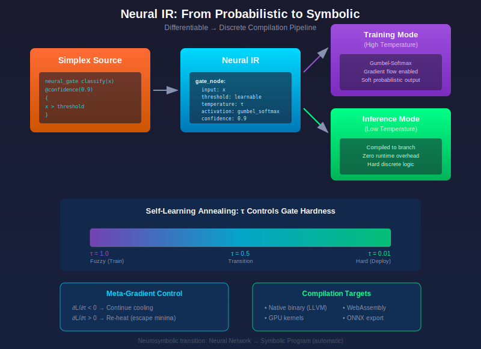
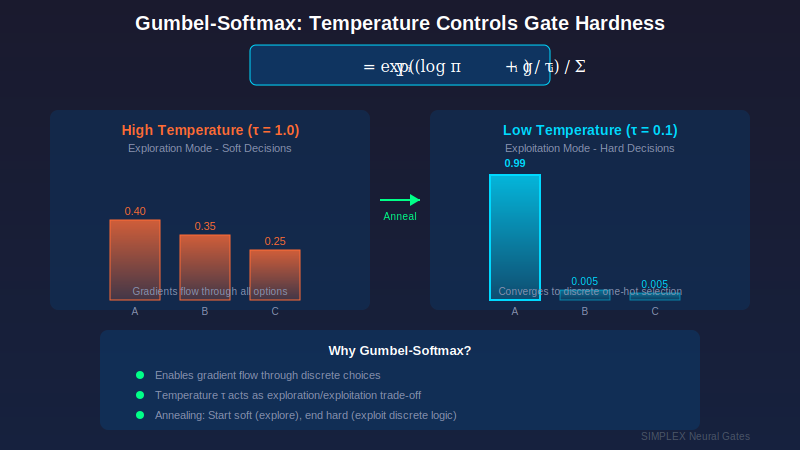
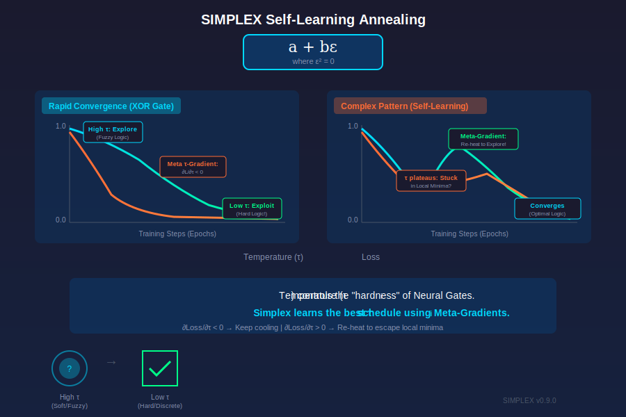

# Neural IR and Differentiable Execution

**Version 0.9.0**

---

## Overview



Neural IR (Intermediate Representation) introduces differentiable program execution to Simplex. This enables program logic itself to become learnable and optimizable via gradient descent, bridging traditional programming with machine learning.

---

## Core Concepts

### Neural Gates

Neural Gates transform discrete control flow into differentiable operations during training, then compile back to efficient discrete branches for inference.

```simplex
// Define a learnable gate
neural_gate should_retry(confidence: f64) -> bool {
    confidence > 0.7
}

// Training mode: compiles to sigmoid((confidence - 0.7) * temperature)
// Inference mode: compiles to standard conditional (zero overhead)
```

### Gumbel-Softmax



For categorical choices, Simplex uses the Gumbel-Softmax trick to enable gradient flow:

```simplex
neural_gate select_strategy(scores: List<f64>) -> Strategy {
    match argmax(scores) {
        0 => Strategy::Conservative,
        1 => Strategy::Balanced,
        _ => Strategy::Aggressive,
    }
}
```

During training:
- Samples from Gumbel distribution
- Applies softmax with temperature parameter
- Gradients flow through all branches (weighted by probability)

During inference:
- Standard argmax selection
- Zero additional overhead

---

## Dual Compilation Modes

### Training Mode

```bash
sxc build --mode=train model.sx
```

- Differentiable execution path
- Gumbel-Softmax for categorical choices
- Gradient tracking enabled
- Temperature annealing support

### Inference Mode

```bash
sxc build --mode=infer model.sx
```

- Standard discrete execution
- Dead path elimination
- Zero neural gate overhead
- Production-optimized binary

---

## Contract Logic

Contracts ensure safety guarantees even with probabilistic gates:

### Requires (Preconditions)

```simplex
neural_gate memory_safe_path(analysis: SecurityAnalysis) -> bool
    requires analysis.confidence > 0.95
{
    analysis.is_safe
}
```

The gate only fires when precondition is met.

### Ensures (Postconditions)

```simplex
neural_gate select_allocator(size: usize) -> Allocator
    ensures result.can_allocate(size)
{
    if size > LARGE_THRESHOLD { Allocator::Large }
    else { Allocator::Small }
}
```

### Fallback Handlers

```simplex
neural_gate risky_optimization(data: Data) -> Output
    requires data.is_valid()
    fallback => safe_default(data)
{
    optimized_path(data)
}
```

When confidence is below threshold or precondition fails, fallback executes instead.

### Invariants

```simplex
neural_gate state_transition(state: State, event: Event) -> State
    invariant state.is_consistent()
{
    compute_next_state(state, event)
}
```

---

## Hardware Targeting

### Explicit Annotations

```simplex
@gpu
neural_gate batch_classifier(inputs: List<Embedding>) -> List<Label> {
    // Runs on GPU - batch tensor operations
    inputs.map(|e| classify(e))
}

@cpu
fn process_result(label: Label) -> Action {
    // Runs on CPU - branching logic
    match label {
        Label::Safe => Action::Allow,
        Label::Suspicious => Action::Review,
        Label::Malicious => Action::Block,
    }
}

@npu
neural_gate cognitive_inference(prompt: String) -> Response {
    // Runs on NPU - SLM inference
    slm.generate(prompt)
}
```

### Automatic Targeting

When no annotation is provided, the compiler analyzes operation types:

| Operation Type | Default Target |
|----------------|----------------|
| Matrix multiplication | GPU |
| Element-wise tensor ops | GPU |
| Control flow, branching | CPU |
| I/O, syscalls | CPU |
| SLM inference | NPU |

---

## Structural Pruning

After training, the compiler eliminates dead paths:

### Weight Magnitude Pruning

```simplex
// Gates with |weight| < threshold are removed
neural_gate rarely_used(x: f64) -> bool {
    x > 0.99  // If weight → 0 during training, gate is pruned
}
```

### Activation Pruning

```simplex
// Paths that fire < threshold% during training are eliminated
neural_gate conditional_path(analysis: Analysis) -> Path {
    match analysis.risk_level {
        Low => Path::Fast,      // Fires 95% - kept
        Medium => Path::Normal, // Fires 4% - kept
        High => Path::Careful,  // Fires 0.1% - may be pruned
    }
}
```

### Gradient Pruning

Gates with consistently zero gradients during training are candidates for removal.

---

## Superposition Memory Model

During training, states may be in superposition (e.g., 50% true / 50% false):

### Lazy Evaluation (Default)

```simplex
let result = match branch_selector(x) {
    A => compute_a(),  // Only allocated if P(A) > threshold
    B => compute_b(),
}
```

### Speculative Execution

```simplex
@speculative
let result = match branch_selector(x) {
    A => compute_a(),  // All branches allocated
    B => compute_b(),  // Results weighted by probability
}
// Low-weight results garbage collected
```

### WeightedRef Type

```simplex
type WeightedRef<T> = {
    ptr: *T,
    weight: f64,  // 0.0 to 1.0
    allocated: bool,
}
```

---

## Temperature Annealing

Temperature controls the "softness" of gates during training:

```simplex
// High temperature (early training): soft decisions, explore
// Low temperature (late training): hard decisions, exploit

let schedule = TemperatureSchedule::exponential(
    initial: 1.0,
    final: 0.1,
    decay_steps: 10000,
);

neural_gate learnable_branch(x: f64) -> bool
    @temperature(schedule)
{
    x > threshold
}
```

---

## Self-Learning Annealing (v0.9.0)



Instead of manually tuning temperature schedules, Simplex can **learn optimal schedules** through meta-gradients. By wrapping the temperature (τ) as a dual number, the system calculates how changes in the cooling rate affect the final loss.

### Visual Overview: Two Training Scenarios

**Scenario 1: Rapid Convergence (Simple Problems like XOR)**

```
Temperature (τ)              Loss
    │                          │
1.0 ┤  ╲ High τ: Explore     1.0 ┤  ╲
    │    ╲  (Fuzzy Logic)        │    ╲
    │      ╲                     │      ╲
    │        ╲ ∂L/∂τ < 0         │        ╲
    │          ╲ (keep cooling)  │          ╲____
0.0 ┤            ╲___________  0.0 ┤
    └───────────────────────      └───────────────────────
    0     Training Steps →        0     Training Steps →
                        Low τ: Exploit (Hard Logic Found!)
```

For simple problems, temperature smoothly decreases. The meta-gradient `∂L/∂τ` remains negative, signaling continued cooling is beneficial.

**Scenario 2: Complex Patterns (Self-Learning Kicks In)**

```
Temperature (τ)              Loss
    │                          │
1.0 ┤  ╲       ╱╲            1.0 ┤  ╲         ____
    │    ╲   ╱    ╲              │    ╲_______/    ╲
    │      ╲╱ Re-heat! ╲         │     Stuck!        ╲
    │    (escape)        ╲       │                     ╲___
0.0 ┤                      ╲   0.0 ┤
    └───────────────────────      └───────────────────────
    0     Training Steps →        0     Training Steps →
```

For complex patterns, the meta-gradient detects when loss plateaus (stuck in local minima). When `∂L/∂τ > 0`, it signals re-heating would help—the system automatically increases τ to explore, then re-cools to converge.

> **Key Insight:** "Temperature (τᵢ) controls the 'hardness' of Neural Gates. Simplex learns the best τᵢ schedule using Meta-Gradients."

See [Meta-Gradient Temperature Control](09-cognitive-hive.md#meta-gradient-temperature-control) for additional implementation details.

### The Meta-Dual Number

Temperature becomes a dual number that tracks sensitivity:

```
τ + τ̇ε
```

Where **τ̇** represents: "If I change the temperature slightly, how does it affect the gate's ability to learn?"

### Inner and Outer Loop Optimization

The language performs nested optimization:

**Inner Loop:** Neural Gates use the current τ to learn the task (e.g., solving a logic puzzle).

**Outer Loop:** After iterations, the system uses Reverse-Mode AD to look back through the training process to determine if a higher or lower temperature would have resulted in faster convergence.

### The Chain Rule for Temperature

When the backward pass executes, it calculates the gradient of Loss (L) with respect to Temperature (τ):

```
∂L/∂τ = (∂L/∂y) · (∂y/∂τ)
```

The second term (∂y/∂τ) tells the system: "If I lower the temperature, does the output move closer to the correct answer or further away?"

For the Gumbel-Softmax function:

```
y = exp((log(π) + g) / τ) / Σ exp((log(π) + g) / τ)
```

The derivative ∂y/∂τ encodes how the "sharpness" of the probability distribution affects the error.

### Meta-Update Rule

The meta-gradient updates the temperature schedule:

```simplex
τ_new = τ_old - η · (∂L/∂τ)
```

**Positive meta-gradient:** Temperature is too low (hardening too fast, making mistakes). The system slows cooling or "re-heats."

**Negative meta-gradient:** Gate is too "soft" or blurry. The system accelerates cooling to force decisions.

### Code Example

```simplex
// Initialize temperature as a trainable Dual Number
var tau: dual = dual::variable(1.0);
let meta_lr = 0.01;

fn train_step(data: &Batch) {
    // Forward Pass: Create gate using current tau
    // Dual number system tracks how tau affects 'choice'
    let gate = Gate::gumbel(logits, temperature: tau);
    let output = gate.forward(data);

    // Reverse Mode: Calculate standard loss gradient
    let loss = compute_loss(output, target);
    loss.backward();  // Triggers chain rule back to tau

    // THE META-UPDATE:
    // Adjust tau based on whether a change would have reduced loss
    let tau_gradient = tau.der;  // Extract ε coefficient (∂L/∂τ)

    tau = dual::variable(tau.val - meta_lr * tau_gradient);

    // Ensure tau stays positive
    tau = tau.max(dual::constant(0.01));
}
```

### Why Self-Learning Annealing is Powerful

| Feature | Benefit |
|---------|---------|
| **Optimal Hardening** | Each gate can have its own local temperature that cools at its ideal speed |
| **Avoiding Local Minima** | Meta-gradient can trigger "re-heating" to escape stuck states |
| **Automatic Logic Synthesis** | System discovers when search phase is over and freezes into discrete logic |
| **No Manual Tuning** | Schedule optimizes itself through gradient descent |

### Comparison: Fixed vs Self-Learning Schedules

| Component | Traditional Annealing | Simplex Meta-Annealing |
|-----------|----------------------|------------------------|
| Decay Rate | Fixed (e.g., 0.99^t) | Dynamic (Learned via ε) |
| Adaptability | None (same for every problem) | High (fast for easy, slow for hard) |
| Complexity | Manual tuning (Trial & Error) | Automated (Gradient Descent on τ) |

### Neurosymbolic Transition

Self-learning annealing enables automatic transition from **Neural Network** (fuzzy/probabilistic) to **Symbolic Program** (discrete/exact):

1. The compiler figures out when the "search phase" is over
2. Gates automatically transition from soft to hard
3. No human intervention required to find optimal annealing schedule

---

## Integration with Autograd

Neural gates integrate seamlessly with Simplex's autograd:

```simplex
fn train_step(model: &mut Model, input: Tensor, target: Tensor) {
    let output = model.forward(&input);  // May contain neural gates
    let loss = mse_loss(&output, &target);

    loss.backward();  // Gradients flow through gates

    optimizer.step(&mut model.params());
}
```

---

## Performance Characteristics

| Metric | Training Mode | Inference Mode |
|--------|---------------|----------------|
| Gate overhead | ~5% vs discrete | 0% (identical to if) |
| Memory | +20% for gradients | Standard |
| Binary size | +15% for autograd | Within 2x of C |
| Throughput | 80% of inference | 100% baseline |

---

## Best Practices

### When to Use Neural Gates

**Good candidates:**
- Thresholds that could be learned (retry limits, confidence cutoffs)
- Routing decisions between strategies
- Feature selection paths

**Poor candidates:**
- Safety-critical branches (use contracts instead)
- Simple, well-understood logic
- Hot loops where any overhead matters

### Training Tips

1. Start with high temperature, anneal slowly
2. Use contracts for safety guarantees
3. Monitor gate weights during training
4. Prune aggressively before deployment

---

## See Also

- [Real-Time Learning](15-real-time-learning.md) - Online adaptation
- [Cognitive Hive AI](09-cognitive-hive.md) - SLM integration
- [The Anima](12-anima.md) - Cognitive agents
- [RELEASE-0.6.0.md](../RELEASE-0.6.0.md) - Full release notes
