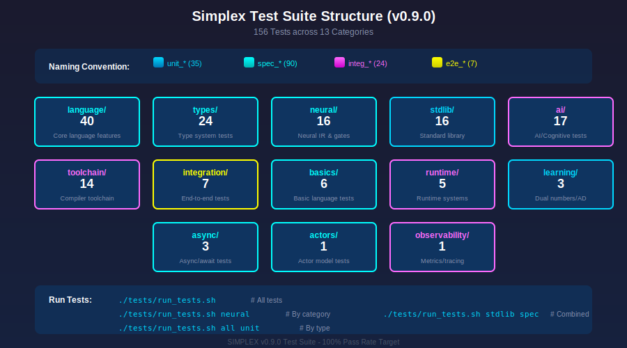

# Simplex Testing Documentation

**Version:** 0.9.0
**Status:** Active Development

This directory contains comprehensive documentation for the Simplex testing framework, including test organization, coverage reports, testing methodologies, and best practices.

## Documentation Index

| Document | Description |
|----------|-------------|
| [Framework Overview](framework.md) | Testing framework architecture and components |
| [Running Tests](running-tests.md) | How to execute and interpret test results |
| [Test Coverage](coverage.md) | Current test coverage by category |
| [Testing Methods](methods.md) | Testing patterns, conventions, and best practices |
| [Writing Tests](writing-tests.md) | Guide for writing new tests |

## Quick Start

Run all tests:
```bash
./tests/run_tests.sh
```

Run tests in a specific category:
```bash
./tests/run_tests.sh language
./tests/run_tests.sh neural
./tests/run_tests.sh learning
```

Filter by test type:
```bash
./tests/run_tests.sh all unit    # Only unit tests
./tests/run_tests.sh all spec    # Only spec tests
./tests/run_tests.sh all integ   # Only integration tests
./tests/run_tests.sh all e2e     # Only end-to-end tests
```

Run a single test:
```bash
sxc run tests/stdlib/unit_hashmap.sx
```

## Naming Convention (v0.9.0)

All tests follow a consistent naming convention based on test type:

| Prefix | Type | Description | Color |
|--------|------|-------------|-------|
| `unit_` | Unit | Tests individual functions/types in isolation | Blue |
| `spec_` | Specification | Tests language specification compliance | Cyan |
| `integ_` | Integration | Tests integration between components | Magenta |
| `e2e_` | End-to-End | Tests complete workflows | Yellow |

### Examples

```
unit_hashmap.sx       # Unit test for HashMap module
spec_generics.sx      # Spec test for generic types
integ_networking.sx   # Integration test for networking
e2e_data_processor.sx # End-to-end data processing workflow
```

## Test Categories



The Simplex test suite is organized into 13 major categories (156 tests total):

```
tests/
├── run_tests.sh                 # Test runner script
├── README.md
│
├── language/                    # Core language features (40 tests)
│   ├── actors/                  # Actor model basics
│   ├── async/                   # Async/await, futures
│   ├── basics/                  # Loops, closures, enums, pattern matching
│   ├── closures/                # Closure capture and nesting
│   ├── control/                 # If-let, match expressions
│   ├── functions/               # Function definitions, generics
│   ├── modules/                 # Module system, imports
│   ├── traits/                  # Trait definitions, associated types
│   └── types/                   # Type system features
│
├── types/                       # Type system tests (24 tests)
│   ├── spec_generics.sx
│   ├── spec_associated_types.sx
│   ├── spec_option_result.sx
│   └── ... (including _p36 phase variants)
│
├── neural/                      # Neural IR and gates (16 tests)
│   ├── contracts/               # Contract logic tests
│   ├── gates/                   # Neural gate tests
│   ├── pruning/                 # Pruning tests
│   └── spec_*.sx
│
├── stdlib/                      # Standard library (16 tests)
│   ├── unit_hashmap.sx
│   ├── unit_crypto.sx
│   ├── unit_string.sx
│   └── ...
│
├── ai/                          # AI/Cognitive systems (17 tests)
│   ├── anima/                   # Agent animation layer
│   ├── hive/                    # Collective intelligence
│   ├── memory/                  # Memory persistence
│   ├── inference/               # LLM inference
│   ├── specialists/             # Specialist providers
│   ├── orchestration/           # Multi-agent coordination
│   └── tools/                   # Tool calling
│
├── toolchain/                   # Compiler toolchain (14 tests)
│   ├── parser/                  # Parser validation
│   ├── codegen/                 # Code generation
│   ├── sxpm/                    # Package manager
│   └── verification/            # Build verification
│
├── runtime/                     # Runtime system (5 tests)
│   ├── actors/                  # Actor runtime
│   ├── async/                   # Async runtime
│   ├── distribution/            # Distributed systems
│   ├── io/                      # I/O operations
│   └── networking/              # Network communication
│
├── integration/                 # End-to-end scenarios (7 tests)
│   ├── e2e_data_processor.sx
│   ├── e2e_multi_specialist.sx
│   └── ...
│
├── basics/                      # Basic language tests (6 tests)
│   ├── spec_closure.sx
│   ├── spec_enum.sx
│   └── ...
│
├── async/                       # Async/await tests (3 tests)
│   ├── spec_async_basic.sx
│   └── ...
│
├── learning/                    # Automatic differentiation (3 tests)
│   ├── unit_dual_numbers.sx
│   ├── unit_dual_simple.sx
│   └── unit_debug_power.sx
│
├── actors/                      # Actor model tests (1 test)
│   └── spec_actor_basic.sx
│
└── observability/               # Metrics and tracing (1 test)
    └── integ_observability.sx
```

## Test Statistics (v0.9.0)

| Category | Tests | Type Distribution |
|----------|-------|-------------------|
| Language | 40 | Mostly spec_ |
| Types | 24 | All spec_ |
| Neural | 16 | Mostly spec_ |
| Standard Library | 16 | Mostly unit_ |
| AI/Cognitive | 17 | unit_ and integ_ |
| Toolchain | 14 | unit_ and integ_ |
| Integration | 7 | All e2e_ |
| Basics | 6 | All spec_ |
| Runtime | 5 | All integ_ |
| Async | 3 | All spec_ |
| Learning | 3 | All unit_ |
| Actors | 1 | spec_ |
| Observability | 1 | integ_ |
| **Total** | **156** | - |

### Type Distribution

| Type | Count | Percentage |
|------|-------|------------|
| `spec_` | 90 | 58% |
| `unit_` | 35 | 22% |
| `integ_` | 24 | 15% |
| `e2e_` | 7 | 5% |

## v0.9.0 Changes

### Test Suite Restructure

The v0.9.0 release includes a complete reorganization of the test suite:

1. **New naming convention**: All tests now use `unit_`, `spec_`, `integ_`, or `e2e_` prefixes
2. **New test runner**: `./tests/run_tests.sh` replaces the old testing approach
3. **Category filtering**: Run tests by category or test type
4. **Colored output**: Visual indicators for test types and results
5. **156 total tests**: Up from 147 in v0.7.0

### New Test Categories

- **learning/**: Tests for dual numbers and automatic differentiation (v0.8.0, v0.9.0)
  - `unit_dual_numbers.sx` - Dual number operations
  - `unit_dual_simple.sx` - Simple AD tests
  - `unit_debug_power.sx` - Power function derivatives

### v0.8.0 Test Additions

Tests added for dual numbers and forward-mode automatic differentiation:

- **Dual Number Operations**: Basic arithmetic with derivative propagation
- **Transcendental Functions**: sin, cos, exp, ln with automatic derivatives
- **Multi-dimensional Gradients**: Testing `multidual<N>` type

### v0.7.0 Test Additions

Tests for Real-Time Learning features:

- **simplex-learning library**: Tensor operations, optimizers, safety constraints
- **Federated learning**: FedAvg, distributed gradient sync
- **Knowledge distillation**: Teacher-student learning

## See Also

- [Simplex Specification](../spec/README.md)
- [Getting Started Guide](../guides/getting-started.md)
- [Release Notes v0.9.0](../RELEASE-0.9.0.md)
- [Release Notes v0.8.0](../RELEASE-0.8.0.md)
- [Release Notes v0.7.0](../RELEASE-0.7.0.md)
